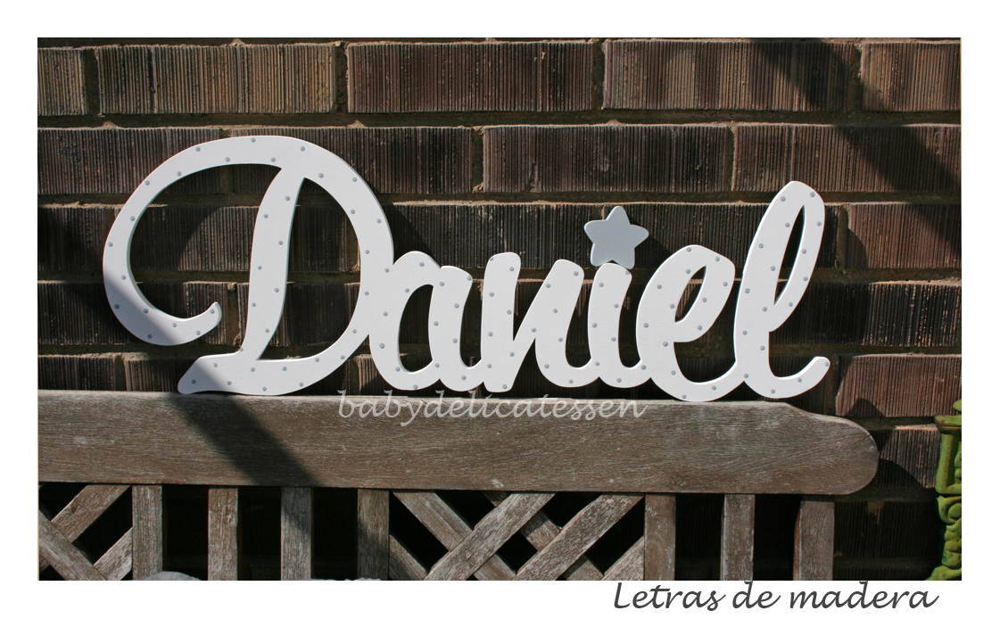

<html lang="es">
<head>
    <meta charset="UTF-8">
    <meta name="viewport" content="width=device-width, initial-scale=1.0">
    <meta http-equiv="X-UA-Compatible" content="ie=edge">
    <link rel="stylesheet" href="https://stackpath.bootstrapcdn.com/bootstrap/4.1.1/css/bootstrap.min.css"
     integrity="sha384-WskhaSGFgHYWDcbwN70/dfYBj47jz9qbsMId/iRN3ewGhXQFZCSftd1LZCfmhktB"
      crossorigin="anonymous">
    <link href="https://fonts.googleapis.com/css?family=Eater" rel="stylesheet">
    <title>Ejemplo estilización</title>
    
</head>
<body>
    <nav class="navbar navbar-expand-lg navbar-light bg-light">
        <a class="navbar-brand" href="yo.html">Daniel</a>
        <button class="navbar-toggler" type="button" data-toggle="collapse" data-target="#navbarSupportedContent" aria-controls="navbarSupportedContent" aria-expanded="false" aria-label="Toggle navigation">
            
        </button>
        

            <ul class="navbar-nav mr-auto">
            <li class="nav-item active">
                <a class="nav-link" href="file:///D:/desarrollo/8jun2018/index.html">Inicio(current)</a>
            </li>
            <li class="nav-item dropdown">
                <a class="nav-link dropdown-toggle" href="#" id="navbarDropdown" role="button" data-toggle="dropdown" aria-haspopup="true" aria-expanded="false">
                Opciones
                </a>
                

                <a class="dropdown-item" href="https://www.youtube.com/">Youtube</a>
                <a class="dropdown-item" href="https://www.Facebook.com/">Facebook</a>
                

                <a class="dropdown-item" href="https://www.Twitter.com/">Twitter</a>
                

            </li>
            <li class="nav-item">
                <a class="nav-link disabled" href="https://www.google.com">Google</a>
            </li>
            </ul>
            <form class="form-inline my-2 my-lg-0">
            <input class="form-control mr-sm-2" type="search" placeholder="Buscar" aria-label="Search">
            <button class="btn btn-outline-success my-2 my-sm-0" type="submit">Buscar</button>
            </form>
        

    </nav>
    
    <a href="javascript:abrir2paginas()">Abre google. Clic acá</a>
    

        <a href="da.html">Otra página</a>
    

    

        
        

                <h1>Lorem Ipsum</h1>
                

                    Este es un ejemplo de una página
                

                
                
                
        

    

</body>
</html>
